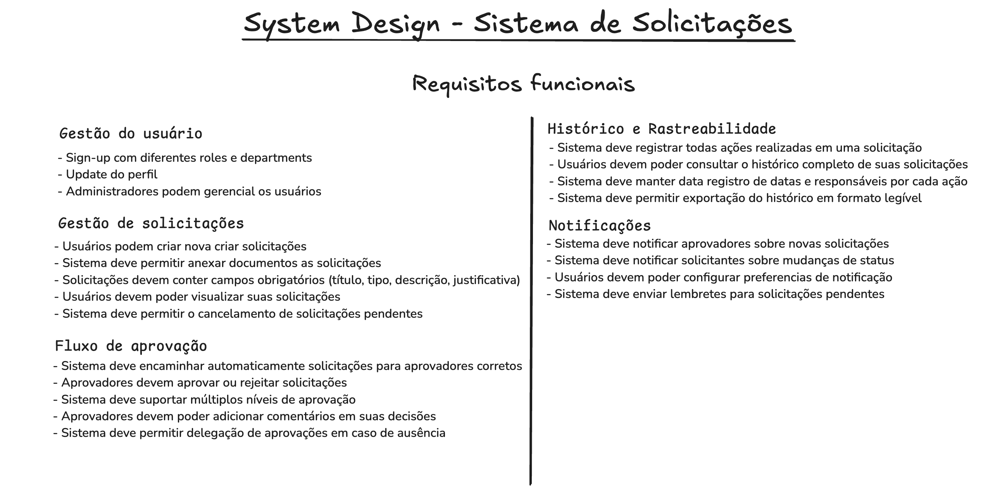
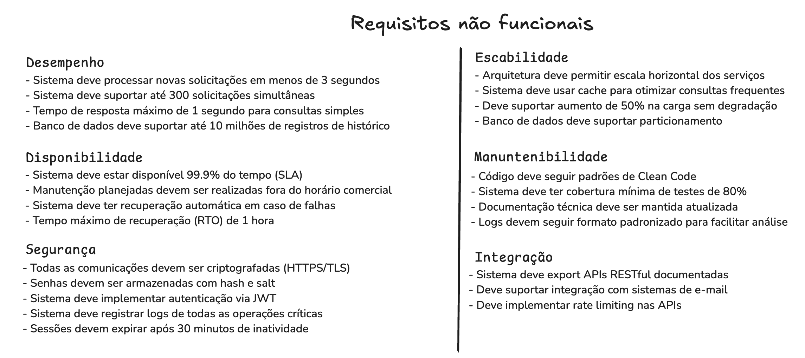

# System Design na prática: Sistema de Solicitações em Go

Hoje vou compartilhar o processo de planejamento de um sistema de solicitações que estou desenvolvendo em Go. A ideia é mostrar uma visão realista do design, focando em decisões práticas e bem fundamentadas.

## Entendendo o Projeto

O sistema que vamos construir é, essencialmente, uma plataforma de gerenciamento de solicitações empresariais. Precisamos lidar com diferentes tipos de requisições, fluxos de aprovação e toda a complexidade que vem junto. Vamos quebrar isso em partes e analisar cada aspecto importante.

## Gestão de Usuários

A base do nosso sistema começa com um gerenciamento de usuários robusto. Precisamos controlar diferentes níveis de acesso e departamentos. Para isso, vamos utilizar Gin para nossa API REST - uma escolha que combina performance com simplicidade. No armazenamento, PostgreSQL se mostra a escolha mais adequada, principalmente pela consistência e suporte a transações complexas. A autenticação será implementada com JWT, mantendo o sistema stateless e escalável.

## Gestão de Solicitações

O coração do sistema está no gerenciamento das solicitações. Aqui precisamos de um CRUD bem estruturado, com suporte a anexos e validações consistentes. Para o armazenamento de arquivos, temos algumas opções a avaliar: MinIO, Amazon S3 ou Google Cloud Storage - a escolha final dependerá de fatores como custo, escalabilidade e necessidades específicas do projeto.

Para a camada de persistência, optei pelo SQLC ao invés de um ORM tradicional. Esta escolha se baseia em alguns pontos cruciais: primeiro, o SQLC gera código Go a partir de SQL puro, o que nos dá controle total sobre nossas queries e garante type safety em tempo de compilação. Além disso, por não ter a sobrecarga de um ORM completo, conseguimos performance superior e queries mais previsíveis. Com SQLC, mantemos a produtividade alta sem sacrificar a capacidade de otimizar cada consulta quando necessário.

As validações serão tratadas com go-validator, garantindo consistência em todas as entradas. A combinação de SQLC com validators nos dá um pipeline de dados seguro e performático, desde a validação da entrada até a persistência no banco.

## Fluxos de Aprovação e Processamento

Uma das partes mais interessantes é o fluxo de aprovações. Aqui é onde entra nossa arquitetura de processamento distribuído. Optei por utilizar mensageria para garantir escalabilidade e resiliência. Temos duas opções principais: RabbitMQ e Kafka.

O RabbitMQ é excelente para filas de processamento direto e comunicação entre serviços, enquanto o Kafka brilha no cenário de eventos que precisam de replay ou histórico completo. Vamos usar Redis para cache e dados temporários, criando uma combinação que nos permite escalar horizontalmente com facilidade.

## Aspectos Não-Funcionais

Performance é crucial: nosso sistema precisa processar solicitações em menos de 3 segundos e suportar 300 requisições simultâneas. Go nos dá ferramentas excelentes para isso com suas goroutines e channels. O connection pooling e uma estratégia sólida de indexação no PostgreSQL complementam nossa abordagem para performance.

A disponibilidade é garantida através de uma arquitetura containerizada com Docker e Kubernetes. Implementamos circuit breakers para resiliência e mantemos logs estruturados para facilitar o diagnóstico de problemas. Nossa meta de 99.9% de uptime é alcançada através de recuperação automática e estratégias de failover bem definidas.

Segurança não é negociável: todas as comunicações são protegidas com HTTPS/TLS, e implementamos práticas robustas de autenticação e autorização. O sistema é projetado para escalar, com cache distribuído e particionamento de dados onde necessário.

## Próximos Passos

No próximo post, vamos mergulhar na modelagem do domínio. Vamos explorar como estruturar nossos agregados, definir o design de eventos e estabelecer padrões claros de comunicação entre serviços. A ideia é construir algo robusto e escalável, mas sempre avaliando o trade-off entre complexidade e benefício.

Cada decisão técnica é ponderada considerando quatro aspectos principais: complexidade versus benefício, manutenibilidade, escalabilidade e custos operacionais. Não queremos over-engineering, mas também não vamos comprometer a qualidade e escalabilidade do sistema.

Todo o código será disponibilizado no GitHub, devidamente documentado e com testes. A ideia é que esse projeto sirva não só como exemplo, mas como base para quem precisa implementar sistemas similares.

#golang #backend #systemdesign #architecture
